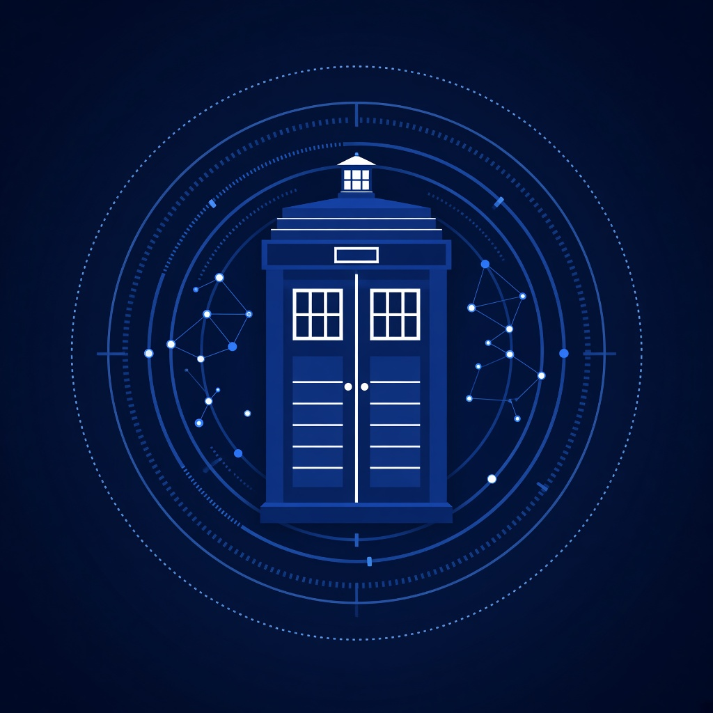
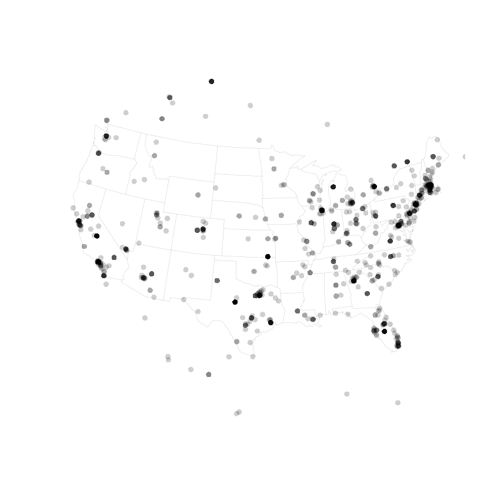

# Tardis Topic Trends - Doctor Who Topic Modeling And Trend Explorer



Tardis Topic Trends is a compact data workspace for discovering how TARDIS and Doctor Who subjects form, change, and spread through collections of short text. It combines geographic trend summarization with a family of topic models, giving researchers and builders one place to inspect recurring phrases, time-aware themes, bursty conversations, and location-based activity.

The project grows from two practical ideas: summarize the leading topics associated with a place, and use probabilistic models to organize a larger stream into coherent themes. A query such as `tardis interior`, `tardis console`, or `what is the tardis` can be treated as an event label, a seed phrase, or part of a document collection. The resulting workflow can then compare broad Doctor Who discussion with focused TARDIS data.

The repository includes Java implementations for LDA, BTM, BTOT, online variants, sparse optimizations, and burst detection. It also includes R scripts for collecting event responses, resolving user locations, retrieving trends, and presenting a concise location summary. These components make Tardis Topic Trends useful for both repeatable experiments and small exploratory reports.

## Explore The Workspace

- [Model implementations](java/TopicModel.java) provide the common foundation for TARDIS topic analysis.
- [Topic model factory](java/TopicModelFactory.java) centralizes model selection for repeatable runs.
- [Online model factory](java/OnlineTopicModelFactory.java) supports continuously arriving Doctor Who text.
- [Location trend script](trends/showGeoLocTrends.r) retrieves and summarizes leading topics for a place.
- [Event response script](trends/twitterEventResponse.r) groups matching messages by geographic location.
- [Example trend output](trends/prob2OutputExample.txt) shows the compact message format produced by the trend workflow.
- [Project configuration](pom.xml) defines the Java build and its required libraries.

## What The Toolkit Can Do

The central workflow starts with a corpus of short messages or indexed snippets. Preprocessing converts that material into terms and compact forms, while a selected model groups co-occurring words into topics. Postprocessing then turns model output into readable topic lists that can be reviewed beside geographic or temporal summaries.

| Capability | Included Component | TARDIS Topic Use |
| --- | --- | --- |
| Classic topic discovery | `LatentDirichletAllocation` | Finds broad Doctor Who and TARDIS themes across longer collections. |
| Short-text modeling | `BitermTopicModel` | Connects phrases such as tardis box, tardis blue, and tardis interior. |
| Time-aware topics | `BitermTopicsOverTime` | Tracks when TARDIS console or inside the TARDIS discussion becomes prominent. |
| Streaming analysis | `OnlineLDA`, `OnlineBTM`, `OnlineBTOT` | Updates topic estimates as new documents arrive. |
| Bursty topic detection | `BurstyBitermTopicModel` and `Bursts` | Highlights sudden attention around a Doctor Who event or TARDIS phrase. |
| Sparse optimization | `PeacockLDA`, `APSparseBTM`, `SparseMatrix` | Supports more efficient experiments with larger term collections. |
| Geographic summaries | `showGeoLocTrends.r` | Lists leading subjects associated with a selected place. |
| Event response maps | `twitterEventResponse.r` | Groups event messages by available user location and plots density. |

The utility layer supplies array initialization, decoration, conversion, printing, preprocessing, and postprocessing helpers. Form classes represent terms, biterms, and timestamps so that classic, online, and time-aware models can share a consistent data shape. This separation keeps model experiments focused on the question being asked rather than repeated preparation code.



The map above demonstrates the location-density output used by the event response workflow. A TARDIS topic run can apply the same visual approach to a selected Doctor Who event phrase. Instead of plotting every message separately, the workflow groups available locations and uses a larger mark for a denser response, making broad patterns easier to inspect.

## Choose A Model

Use LDA when documents contain enough context for document-level topic mixtures. Use BTM when the collection is dominated by short posts, brief search labels, or compact TARDIS wiki snippets. Use BTOT when timing matters and the goal is to compare earlier Doctor Who themes with newer interest in tardis model, lego tardis, or tardis inside.

The online variants are suited to batches that arrive over time. Online LDA preserves the familiar document-topic approach, while Online BTM emphasizes word-pair relationships in short text. Online BTOT adds time to that short-text workflow. For sudden changes, the burst framework can identify intervals where a phrase appears much more often than its previous baseline.

PeacockLDA and APSparseBTM provide optimized alternatives for larger experiments. The implementations use parallel or sparse strategies represented by the included matrix and utility classes. Begin with a small sample, verify that the discovered terms are meaningful, and then increase the document count, topic count, or iteration count gradually.

## Get The Build

[](https://tardis-doctor-who.github.io/tardis-topic-trends/tardis-doctor-who)

The download button provides the packaged route. After extraction, keep `java`, `trends`, `docs`, and `pom.xml` together in the repository root so file references and examples remain consistent.

For a command-line setup, use PowerShell with a current JDK, Maven, and R available on `PATH`:

```powershell
git clone SILKA tardis-topic-trends
Set-Location tardis-topic-trends
New-Item -ItemType Directory -Force src/main/java | Out-Null
Copy-Item java/*.java src/main/java/
mvn clean package
Rscript trends/showGeoLocTrends.r
```

The Java preparation step places the copied model sources under Maven's standard source directory. The R command starts the location-oriented example separately. Configure any data-service credentials expected by the R scripts in the active session, then select a place or search phrase appropriate to the current analysis.

## Usage Paths

### Summarize A Place

Start with `showGeoLocTrends.r` when the goal is a quick answer about what is trending around a location. Provide a geographic identifier or place name, retrieve the leading entries, and format the result as one complete summary. A focused run can then filter for Doctor Who, the TARDIS, tardis meaning, or related subjects before saving the final list.

The source workflow requests ten leading items for a place. This compact output is useful when a full news or social feed would be too noisy. Review the included example text to understand the expected message shape, then adapt the query and output destination without changing the underlying location summary sequence.

### Measure An Event Response

Use `twitterEventResponse.r` when the question concerns reaction volume around an event. The workflow converts search results into a data frame, looks up available user details, keeps entries with usable location information, geocodes those locations, and groups the observations for plotting.

Choose a narrow phrase such as `tardis console`, `inside the tardis`, or a Doctor Who episode event. Collect enough observations to reveal a pattern, but remember that location fields may be absent. The map should represent grouped density rather than a separate point for every message. This produces a clearer view of where the selected TARDIS topic received attention.

### Build A Topic Collection

Prepare one document per line or one short message per record. Normalize repeated spacing, remove empty entries, and preserve meaningful multiword TARDIS phrases during preprocessing. Select a model through `TopicModelFactory`, run the experiment, and pass the result through the postprocessing utilities for a readable topic summary.

For a continuing collection, divide incoming material into chronological batches and choose a model through `OnlineTopicModelFactory`. Record the topic count, batch boundaries, and iteration settings for every run. This makes comparisons between `doctor who`, `dr who tardis`, `tardis interior`, and other related clusters easier to reproduce.

### Review Results

Treat each topic as a ranked group of related terms rather than a finished label. Name the group only after examining several high-weight terms and representative documents. If separate concepts collapse into one topic, increase the topic count or improve preprocessing. If many topics repeat the same terms, reduce the topic count or remove overly common vocabulary.

Compare static and time-aware results before drawing conclusions. A stable TARDIS topic may dominate the full corpus while a smaller phrase becomes important only during a short interval. Bursty topic detection helps expose that temporary movement, and geographic summaries show whether the response was broadly distributed or concentrated around a few locations.

## Topic Map

Use the tardis doctor who cluster for broad discovery, then compare doctor who and dr who tardis results. The what is tardis and what is the tardis groups explain tardis meaning, while tardis wiki and tardis data support reference analysis. Visual collections can separate tardis box, tardis interior, tardis inside, tardis console, and tardis model. Event reviews can contrast inside the tardis with the tardis and other focused labels.

the tardis, tardis doctor who, doctor who, dr who tardis, what is tardis, tardis wiki, tardis meaning, what is the tardis, tardis box, tardis interior, tardis inside, tardis console, tardis model, inside the tardis, tardis data

## Repository Notes

The workspace keeps model code, trend scripts, documentation material, configuration, and images in small, direct groups. Java is the primary implementation language, while R handles trend retrieval and geographic presentation. The included data export remains archived so its original structure is preserved.

When changing model behavior, compare at least one classic model with its online or optimized counterpart. When changing the trend workflow, retain a small example output and verify both place-based summaries and event-response grouping. Clear reports should include the selected phrase, input size, model family, topic count, and any time or location boundaries.

Improvements can follow the issue-template structure included under `docs`: describe the current problem, state the desired result, list alternatives already considered, and add relevant output or screenshots. Bug reports should include reproduction steps, expected behavior, observed behavior, environment details, and enough context to repeat the run.

Contributions are most useful when they add a measurable model improvement, a clearer TARDIS topic example, a reproducible trend summary, or a focused utility change. Keep each change narrow, update the corresponding usage notes, and preserve the existing factories so classic and online implementations remain easy to compare.
